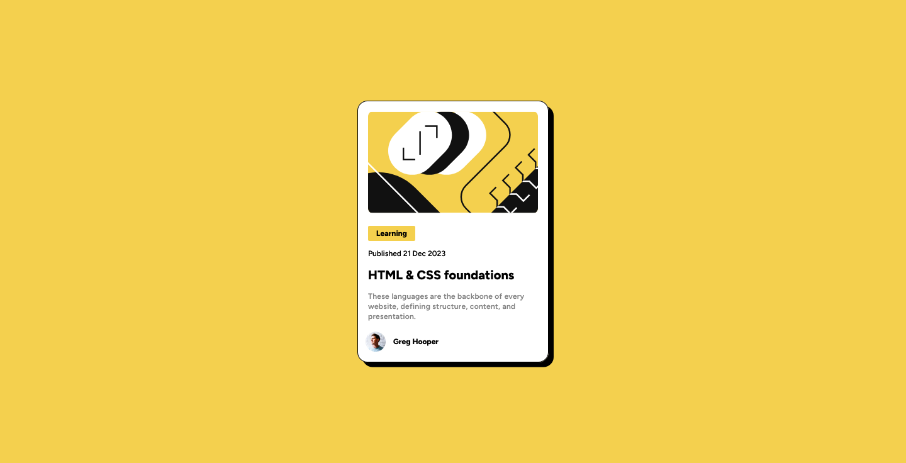
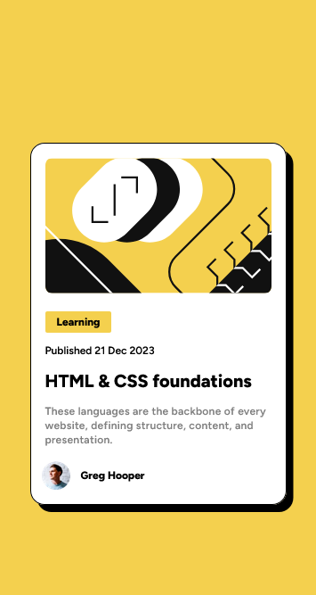

## Table of contents

- [Overview](#overview)
  - [The challenge](#the-challenge)
  - [Screenshot](#screenshot)
  - [Links](#links)
- [My process](#my-process)
  - [Built with](#built-with)
  - [What I learned](#what-i-learned)
  - [Continued development](#continued-development)
  - [Useful resources](#useful-resources)
- [Author](#author)
- [Acknowledgments](#acknowledgments)

## Overview

This is my 3rd project in FrontEnd Mentor using HTML & Tailwind.

### The challenge

This HTML & CSS-only challenge is a perfect project for beginners getting up to speed with HTML and CSS fundamentals, like HTML structure and the box model.

### Links

- Solution URL: [Add solution URL here](https://www.frontendmentor.io/solutions/responsive-recipe-page-using-css-grid-and-flexbox-8BHL87qQb2)
- Live Site URL: [Add live site URL here](https://sleepypillowz-blog-preview.netlify.app)

### Screenshot

## My process

  1. I setup my environment with vs code
  2. I read the style guide
  3. I applied them in preperation
  4. I created the skeleton of the html
  5. I styled them with tailwind
  6. I organized the code using @layer

### Built with

- Semantic HTML5 markup
- CSS custom properties
- CSS Flex Box
- Mobile-first workflow
- [Tailwind](https://tailwindcss.com/) - CSS framework

### What I learned

- The customization of box-shadow in tailwind

### Continued development

There are certain bugs/visuals that I'd like to fix in the future
  - The Image is too wide and tall compared to the given desktop design
  - The Learning border radius is a bit off

### Useful resources

- [Tailwind](https://tailwindcss.com/) - This helped me refer to unfamiliar concepts and resources I may be able to use.

## Author

- Website - [alexacojido](https://alexacojido.netlify.app/)
- Frontend Mentor - [@sleepypillowz](https://www.frontendmentor.io/profile/sleepypillowz)
- Github - [sleepypillowz](https://github.com/sleepypillowz)

## Acknowledgments

Big thanks to The tailwind team for a good framework and documentation. Frontend mentor for providing a structured way of building websites.